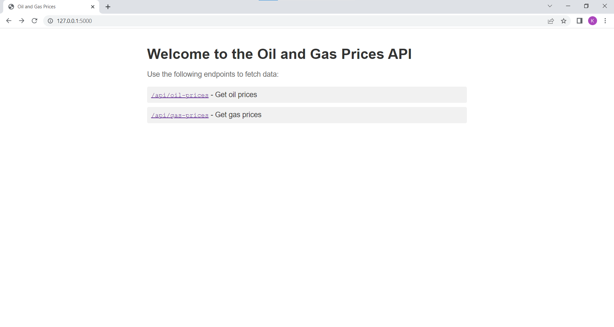
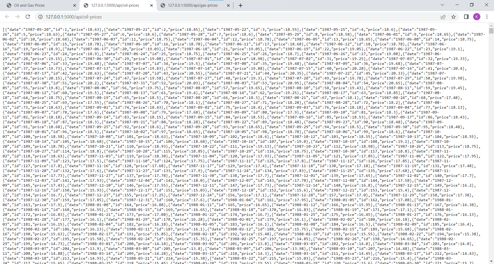
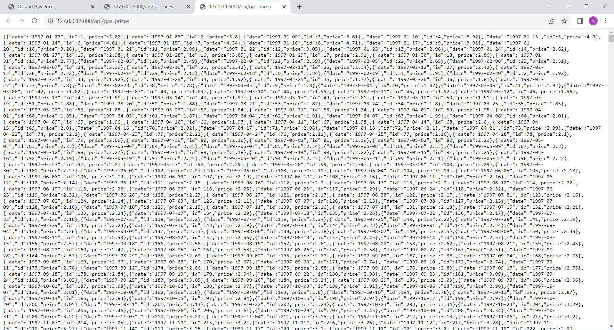
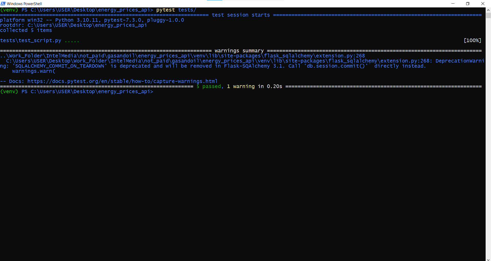
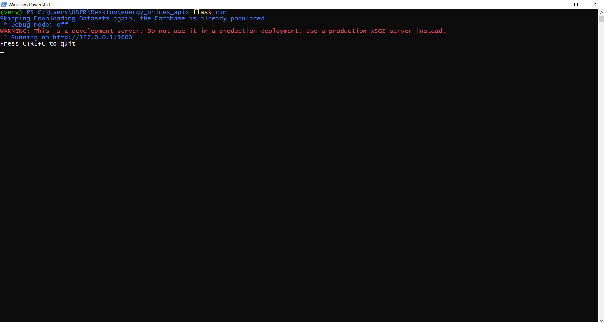

# Energy Prices API Test Script README
This README describes the test_script for the Energy Prices API, which includes a series of tests to ensure the proper functionality of the API endpoints related to Oil and Gas prices. The test script is designed to validate the behavior of the API when processing requests and handling database operations.

The test script is composed of five tests:

test_index(client): This test checks if the root endpoint (/) returns a successful response with a status code of 200.

test_get_oil_prices(client, _db): This test validates the /api/oil-prices endpoint. It creates an OilPrice instance with a specific date and price, adds it to the database, and sends a GET request to the endpoint. The test checks if the response has a status code of 200, and if the returned data matches the expected date and price.

test_get_gas_prices(client, _db): Similar to the previous test, this one checks the /api/gas-prices endpoint. It creates a GasPrice instance, adds it to the database, and sends a GET request to the endpoint. The test checks if the response has a status code of 200, and if the returned data matches the expected date and price.

test_oil_prices_date_range(client, _db): This test validates the /api/oil-prices endpoint with a specific date range. It creates two OilPrice instances with different dates and prices, adds them to the database, and sends a GET request to the endpoint with the specified date range. The test checks if the response has a status code of 200, and if the returned data includes both instances with the correct dates and prices.

test_gas_prices_date_range(client, _db): Similar to the previous test, this one checks the /api/gas-prices endpoint with a specific date range. It creates two GasPrice instances with different dates and prices, adds them to the database, and sends a GET request to the endpoint with the specified date range. The test checks if the response has a status code of 200, and if the returned data includes both instances with the correct dates and prices.

# Results:

After running the tests using the pytest command, the results show that all five tests passed successfully, and a warning related to the deprecation of the SQLALCHEMY_COMMIT_ON_TEARDOWN configuration option in Flask-SQLAlchemy was captured. The warning suggests calling db.session.commit() directly instead of using the deprecated option.

In summary, the test script validates the functionality of the Energy Prices API by testing the root endpoint and the Oil and Gas prices endpoints, both without and with a specified date range. The results indicate that the API is working correctly, and the warning captured provides guidance on how to improve the codebase by removing the usage of a deprecated option.

